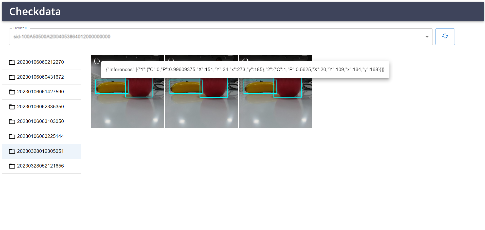
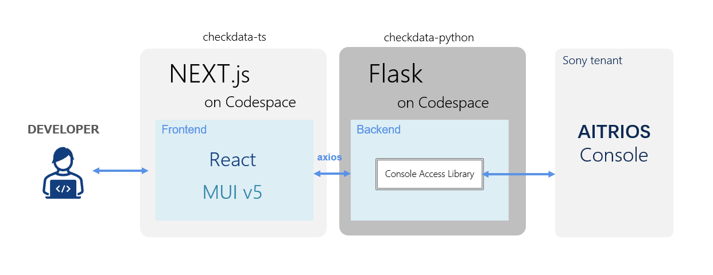
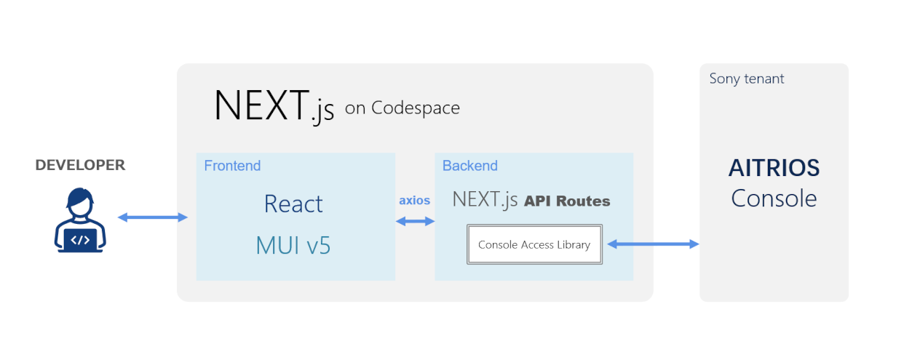
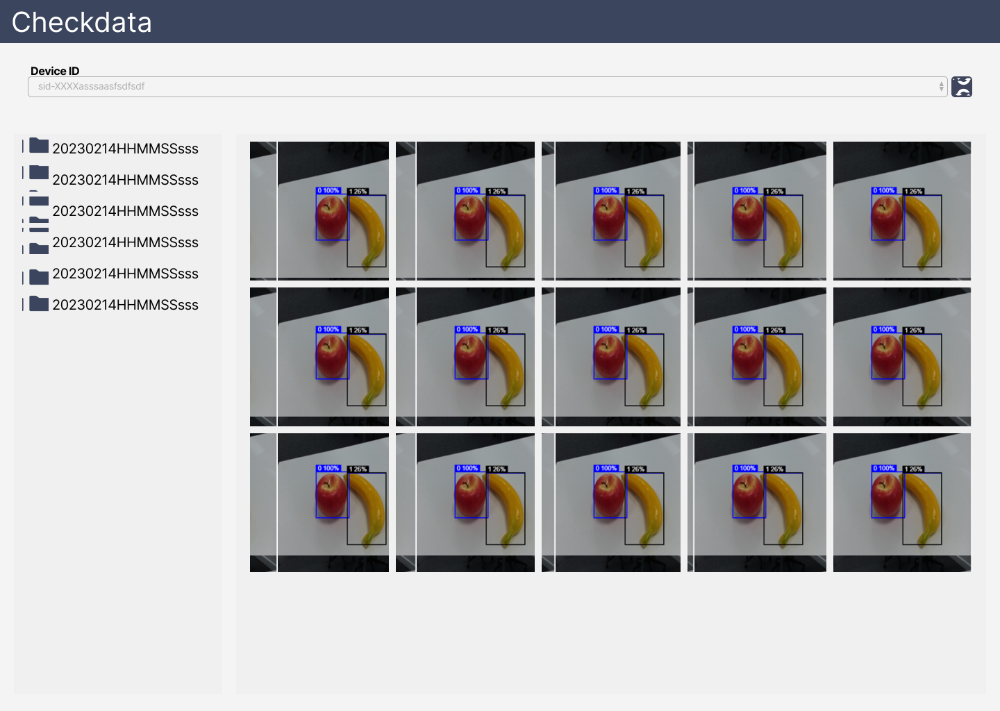

# Tutorial Checkdata: Sample Application on AITRIOS

## Contents
- [Contents](#contents)
- [Overview](#overview)
- [Get started](#get-started)
- [Specifications](#specifications)
  - [Application stuck](#application-stuck)
  - [Functional overview](#functional-overview)
  - [Algorithm](#algorithm)
  - [Commands](#commands)
  - [Restrictions](#restrictions)
- [Get support](#get-support)
- [See also](#see-also)
- [Trademark](#trademark)
- [Notice](#notice)


## Overview

This repository provides sample code for a [Next.js](https://nextjs.org/) application that display visualized inference results in a web browser, as well as configuration files for building a development environment. This application retrieves object detection base AI model metadata from AITRIOS Console and display Bonding box on the captured image.



## Get started

### Build an environment and get started with the sample application

1. Clone or fork this application in your GitHub environment.
2. Click the `+` button to create a codespace on the GitHub environment. See [how to create a codespace](https://docs.github.com/en/codespaces/developing-in-codespaces/creating-a-codespace-for-a-repository).
3. Run the sample application using the following command.
    ```
    $ npm run dev
    ```
4. Open `localhost:3000` in a browser and verify that the application is running.

> **Note**
> To make this app fully operational, start the backend app([aitrios-sample-application-check-data-tool-python
](https://github.com/SonySemiconductorSolutions/aitrios-sample-application-check-data-tool-python)) and specify the hosted address in the config file.
If the environment is codespaces, the url on codespaces must be specified.  (e.g., `https\://user-name-container-name-xxxxxxxxx-5000.preview.app.github.dev`)
> `src/config/backendConfig.ts`
> ```
> const baseURL = 'http://localhost:5000'    // Default address, when starting checkdata-python locally 
>
> export default baseURL
> ```

#### Use next.js API Routes feature for API server(Alt mode)

This app can operate using the Next.js backend API functionality without launching a [backend app](https://github.com/SonySemiconductorSolutions/aitrios-sample-application-check-data-tool-python) separately.

1. Create console access setting configuration file with real values under [src/config/](./src/config/console_access_settings.yaml.sample).
    `src/config/console_access_settings.yaml`
    ```
    console_access_settings:
        console_endpoint: "__console_endpoint__"
        portal_authorization_endpoint: "__portal_authorization_endpoint__"
        client_secret: "__client_secret__"
        client_id: "__client_id__"
    ```

    > **Note**
    > * Specify the base URL
    > * Specify the token URL
    > * Specify registered application secret for client_secret
    > * Specify registered application client ID for client_id

    Refer to the [Portal user manual](https://developer.aitrios.sony-semicon.com/documents/portal-user-manual) for details.
2. Specify the same address where this application is hosted in the config file.If the environment is codespaces, the url on codespaces must be specified.  (e.g., `https://user-name-container-name-xxxxxxxxx-3000.preview.app.github.dev`)
    `src/config/backendConfig.ts`
     ```
     const baseURL = 'http://localhost:3000'    // Default address, when starting this app locally
    
     export default baseURL
     ```

## Specifications

### Application stuck



#### **Alt mode**



| Package | Version | Description |
|---------|---------|-------------|
| `Node.js` | `^16.16.0 `| Cross-platform JavaScript runtime environment and library for running web applications. |
| `TypeScript` | `^4.9.5` | Syntactic superset of JavaScript which adds static typing. |
| `Next.js` | `13.1.6` | React-based web application development framework with server-side rendering and static website generation. |
| `React` | `18.2.0` | Front-end JavaScript library for building user interfaces based on components. |
| `MUI` | `^5.11.9` |  Library of UI design components that developers can easily import to build React applications. |
| `Flatbuffers` | `1.11.0` | Cross platform serialization library for various languages. |
| [`ConsoleAccessLibrary`](https://github.com/SonySemiconductorSolutions/aitrios-sdk-console-access-lib-ts) | `0.2.0` | SDK Library that provides API requests to the AITRIOS Console. |

### Functional overview

- Inference result viewer
  - A list of edge AI devices connected to the Console is displayed on the screen.
  - A list of sub-directories containing images and inference results taken with the specified device is displayed on the screen.
  - A list of images that draw the BoundingBox included in the inference results is displayed on the screen.
  - Reset the list of images and subdirectories displayed on the screen.
- Only object detection is supported as baseAI model.
- It can be run on Dev Containers/GitHub Codespaces.

### Algorithm



**1. Device selector**

1. When the page is first opened, the getDeviceInfo API is called to get the DeviceID list of edge AI devices registered in the Console.
2. The gotten Device ID list of edge AI devices is set to the **Device selector** drop-down list.
3. Choose Device ID of purpose from the **Device selector** drop-down list.

**2. Sub-directory selector**

1. When a Device ID is selected, The getSubDirectoryList API is called to get a list of sub-directories where the inference source images are stored.
2. The gotten sub-directory list of certain device is set to the **Sub-directory selector** list on the sidebar.
3. Choose sub-directory of purpose from the **Sub-directory selector** sidebar list.

**3. Inference result viewer**

1. When a sub-directory is selected, the getImages API is called to get a list of images that stored in specified sub-directory.
> **Note**
> At this time, the number of images retrieved from the subdirectory is limited to the latest 5. This is a provisional measure to avoid delays in screen display due to the time consuming deserialization process described below.
> To change the number of images acquired, modify the following section of the source code.
> `src/features/showcase/showWindow.tsx`
> ```
>...
> axios
>   .get('/api/getImagesAndInferences', {
>     params: {
>       deviceId: targetDevice,
>       imagePath: targetDirectory,
>       numberOfImages: 5,          // change this number
>     },
>   })
> ...
> ```

2. The getInferenceResult API is called to obtain a list of inference results linked with the timestamp of the images obtained above.
3. Decode the obtained inference result in base64 and deserialize it in Flatbuffers. You can obtain the vertex coordinates of the BoundingBox as follows.
```
{
    // { "C": Class, "P": Probability, "X": Top-left x-coordinate, "Y": Top-left y, "x" Bottom-right x, "y": Bottom-right y }
    "1": { "C": 0, "P": 0.6796875, "X": 197, "Y": 125, "x": 300, "y": 255 },
    "2": { "C": 0, "P": 0.50390625, "X": 196, "Y": 177, "x": 295, "y": 292 },
    "3": { "C": 0, "P": 0.4375, "X": 217, "Y": 101, "x": 295, "y": 289 }
}
```
4. Based on the vertex coordinate information contained in the plain text inference result, a BoundingBox is drawn on the image and displayed on the **Inference result viewer** area.

5. By pressing the icon button in the upper left corner of the image, you can view the inference results in JSON format.

**4. Reset button**

1. If data is displayed in the Inference result viewer or sub-directory selector, press the button to clear the contents.

### Commands

The main available `npm` commands are as follows.

#### `npm install`

Install locally the dependent packages listed in package.json that exist in the current directory. When using devcontainer or Codespaces, this is done automatically at container startup.

#### `npm run dev`

Start the development server for the Next.js application. By default, the app is hosted on port 3000.

#### `npm run test`

Run all test codes. The test code is placed under `test/`.

- `npm run test -- <regex>` - You can specify the file name of the test you wish to run by pattern matching. e.g., `npm run test -- deviceSelect` runs the test case in `test/features/showcase/components/deviceSelect.test.tsx`

#### `npm run lint`

Run the static analysis tool `ESlint` to detect code with execution problems. See `.eslintrc.json` for detection rule definitions.

- `npm run lint:fix` - Automatically fix any detected codes that can be done automatically.

#### `npm run fmt`

Run the automatic formatting tool `Prettier` to perform automatic formatting of codes based on coding rules. See `.prettierrc.json` for formatting rule definitions.

### Restrictions

None

## Get support

- [Contact us](https://developer.aitrios.sony-semicon.com/contact-us/)

## See also

- [aitrios-sdk-console-access-lib-ts](https://github.com/SonySemiconductorSolutions/aitrios-sdk-console-access-lib-ts)
- [aitrios-sdk-cloud-app-sample-ts](https://github.com/SonySemiconductorSolutions/aitrios-sdk-cloud-app-sample-ts)

## Trademark
- [Read This First](https://developer.aitrios.sony-semicon.com/development-guides/documents/manuals/)

## Notice

### Security

Before using Codespaces, please read the Site Policy of GitHub and understand the usage conditions.

## Versioning

This library aims to adhere to Semantic Versioning 2.0.0.

## Branch

See the Release Note from Releases for this repository.

Each release is generated in the main branch. Pre-releases are generated in the develop branch. Releases will not be provided by other branches.
